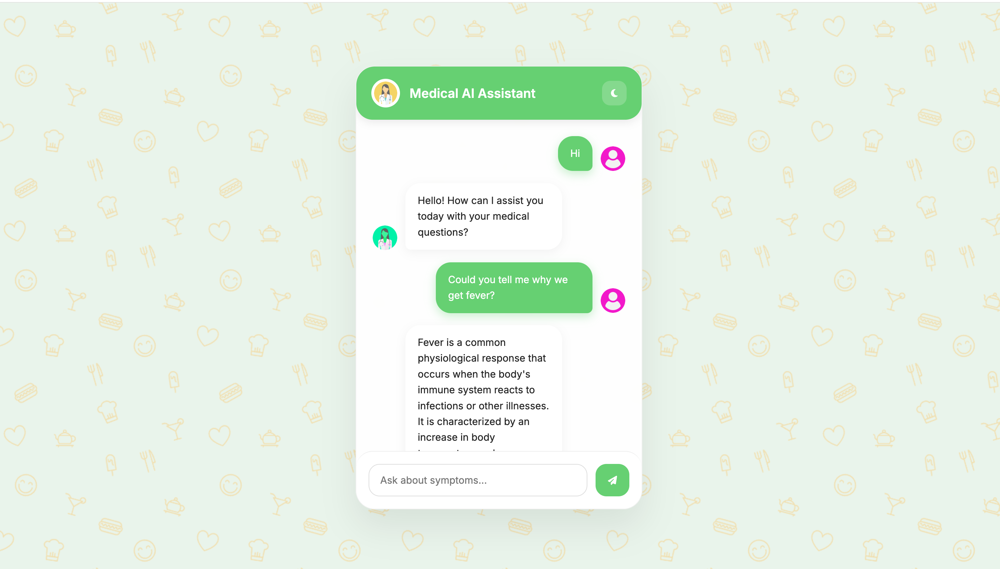

🏥 Medical Chatbot using RAG (LangChain + Pinecone + OpenAI)

A Medical AI Chatbot built using Retrieval-Augmented Generation (RAG) that answers medical questions by retrieving relevant knowledge from medical documents.

The system integrates LangChain, Pinecone, Sentence Transformers, OpenAI, and Flask, and is containerized using Docker and deployed on AWS (ECR + EC2).

🚀 Demo

Example interaction:

User: What are the symptoms of diabetes?

Chatbot: Common symptoms of diabetes include increased thirst,
frequent urination, fatigue, blurred vision, and slow healing wounds.
🧠 System Architecture
                   User
                    │
                    ▼
               Flask UI
                    │
                    ▼
           LangChain RAG Pipeline
                    │
        ┌───────────┴───────────┐
        ▼                       ▼
Sentence Transformer        Query Embedding
(Embeddings)                    │
        │                       │
        ▼                       ▼
     Pinecone Vector Database (Similarity Search)
                    │
                    ▼
          Relevant Context Retrieved
                    │
                    ▼
                OpenAI LLM
                    │
                    ▼
            Generated Response
                    │
                    ▼
               Flask UI Output
🛠️ Tech Stack
Layer	Technology
LLM	OpenAI
Framework	LangChain
Vector Database	Pinecone
Embeddings	Sentence Transformers
Backend	Flask
Programming Language	Python
Containerization	Docker
Cloud	AWS EC2
Container Registry	AWS ECR
📂 Project Pipeline
1️⃣ Document Loading

Medical knowledge is loaded from a document and used as the chatbot's knowledge base.

Steps:

Load document

Clean text

Split into chunks

2️⃣ Text Chunking

Large documents are split into smaller chunks to improve retrieval accuracy.

Benefits:

Better semantic search

Faster retrieval

Improved LLM context

3️⃣ Embedding Generation

Each chunk is converted into embeddings using:

Sentence Transformers

Embeddings represent the semantic meaning of the text.

4️⃣ Vector Storage (Pinecone)

Embeddings are stored in Pinecone Vector Database.

Advantages:

Fast similarity search

Scalable vector storage

Efficient retrieval

5️⃣ Retrieval-Augmented Generation (RAG)

When a user asks a question:

Query is converted into embeddings

Pinecone retrieves the most relevant chunks

Context is passed to the LLM

LLM generates a grounded response

6️⃣ Response Generation

The OpenAI model generates the final response using retrieved context.

LangChain manages the entire RAG pipeline.

🌐 Flask Web Application

The user interacts with the chatbot through a Flask-based web interface.

Flask handles:

User input

Query processing

LLM response display

⚙️ Local Setup
Clone Repository
git clone https://github.com/Supriyam-Mishra/Medical-chat-bot.git

Create Virtual Environment
python -m venv venv

Activate:

Mac/Linux

source venv/bin/activate

Windows

venv\Scripts\activate
Install Dependencies
pip install -r requirements.txt
Configure Environment Variables

Create .env

OPENAI_API_KEY=your_openai_api_key
PINECONE_API_KEY=your_pinecone_api_key
PINECONE_ENV=your_environment
Run Application
python app.py

Open browser:

http://localhost:5000
🐳 Docker Setup
Build Docker Image
docker build -t medical-chatbot .
Run Docker Container
docker run -p 5000:5000 medical-chatbot
☁️ AWS Deployment

The project is deployed using:

AWS ECR (Docker Image Registry)

AWS EC2 (Compute Instance)

Step 1: Create IAM Role

Permissions used:

AmazonEC2FullAccess

AmazonEC2ContainerRegistryFullAccess

This allows EC2 instances to pull images from ECR and run containers.

Step 2: Push Docker Image to ECR
docker tag medical-chatbot:latest <ECR_REPOSITORY_URI>

docker push <ECR_REPOSITORY_URI>
Step 3: Launch EC2 Instance

Steps:

Launch EC2

Attach IAM role

Install Docker

Pull image from ECR

docker pull <ECR_REPOSITORY_URI>
Step 4: Run Container
docker run -d -p 80:5000 <ECR_REPOSITORY_URI>

Access the chatbot via EC2 Public IP.

💡 Key Features

✅ Retrieval-Augmented Generation (RAG)
✅ Semantic search using Pinecone
✅ Context-aware responses
✅ Flask-based UI
✅ Docker containerization
✅ AWS cloud deployment
✅ Scalable architecture

🔮 Future Improvements

Multi-document support

Chat memory

Authentication system

Kubernetes deployment

Monitoring & logging

Streaming responses

👨‍💻 Author

Supriyam Mishra and Rajiv Nagar

AI / Data Science Enthusiast
Focused on LLMs, RAG Systems, and AI Engineering